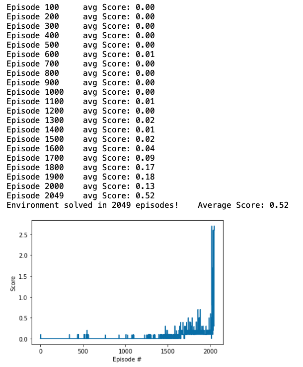
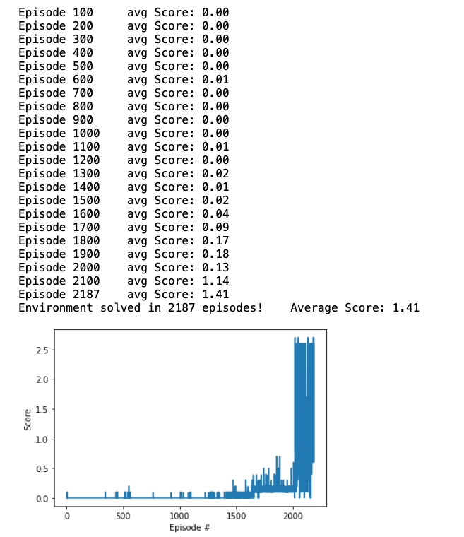

# Project 3 - Report Collab Compete

## Motivation and Results

The Resulting Agent behaves in the environment like this:<br>


The trained agents perform pretty good. They can handle long and short throws, as well as recover from to weak hits by
hitting a second time.

The Agent was trained within 2049 episodes: <br>


There was almost no growth observed in the beginning of training. After a short period of mediocre play, the agents
learned to play the game almost perfectly. This was surprising to me.

After being trained the agent plateaued. The agent plateaued at a value of at least 1.4.



## Learning Algorithm

Two agents using Deep Deterministic Policy Gradient (DDPG) were used to train the agent. However both agents share a
common replay buffer.

The actor and the critic networks are different for each agent.<br>
An alternative implementation using a single critic was also tried, but observed to be less stable.

### State and Action Spaces

The action space for each actor consists of 2 different continuous actions. One action value controls the horizontal
velocity. The other action value controls the vertical velocity.

The state space consists of 24 dimensions and is continuous. The observations contain velocity and position of the ball
and the racket.

### Implementation of DDPG

Each agent consists of an actor and a critic. Each containing a target and a local neural network.

Combined critics were tried, but were observed to be unstable.

The critic of an agent receives a state and an action as input and outputs the value it thinks that state-action pair is
supposed to have.

The actor of an agent received a state and outputs an action vector, each output node mapping to one continuous action.

#### Replay Buffer

All actors share a combined replay buffer, in which experiences are stored. Prioritized memory replay was not
implemented as of date, but were acknowledged as a good potential way of decreasing training time.

#### Training

Training occurs in each actor on its own. Both the critic and the actor are trained in the function below. <br>
Because of its importance the function used for learning will be explained more in the following:

```python

states, actions, rewards, next_states, dones = experiences

# --- train the critic ---
next_actions = self.actor_target(next_states)
# Get expected Q values from local critic by passing in both the states and the actions
Q_expected = self.critic_local.forward(states, actions)
# Get next expected Q values from local critic by passing in both the next_states and the next_actions
next_Q_targets = self.critic_target(next_states, next_actions)
# Compute Q targets for current states
Q_targets = rewards + (gamma * next_Q_targets * (1 - dones))
# Caclulate the loss function using the expected return and the target
critic_loss = F.mse_loss(Q_expected, Q_targets)
self.critic_optim.zero_grad()
critic_loss.backward()
torch.nn.utils.clip_grad_norm_(self.critic_local.parameters(), 1)
self.critic_optim.step()

# --- train the actor ---
# create the action predictions by passing the states to the local network
actions_prediction = self.actor_local.forward(states)
# calculate the loss function of the actor
actor_loss = -self.critic_local(states, actions_prediction).mean()
self.actor_optim.zero_grad()
actor_loss.backward()
self.actor_optim.step()

# soft update the target networks
self.soft_updatee(self.critic_local, self.critic_target, TAU)
self.soft_updatee(self.actor_local, self.actor_target, TAU)
```

At first the states, actions, rewards, next states are extracted from the experiences.<br>

##### Training of the Critic:

The expected value of the current state is computed using the states and actions. (And called Q_expected)<br>
The expected value of the next state is computed using the next_states and next_actions. (And called
next_Q_expected)<br>
The target value for the Q value is then calculated using the reward and Q_expected multiplied with discount factor
gamma. After having obtained all the values above it is possible to calculate the loss function and subsequently update
the local network using gradient descent.

##### Training of the Actor

The prediction of the action taken is obtained by passing the current state through the local_actor network. The result
is used to compute the loss function, which is negated to perform gradient ascent on the state value.

#### Soft Updating

After this the target network is updated using the weights and biases from the trained local network and a factor Tau.
Tau determines how fast the target network should adopt the weights and biases from the local network.

### Model Architecture of Neural Model

#### Critic Structure

* The activation function chosen is RELU
* The first layer has the size of the state size in this case: 24
* The second layer has the size of the output of the first layer + the size of the action. In this case: 128 + 2
* The action is passed to the network in the second layer
* The third layer has a single output: representing the value of the given state

#### Actor Structure

* The activation function chosen for the first two layers is RELU
* The input size of the first layer is the size of the state size: in this case: 24
* The first layer has 128 nodes
* The second layer has 128 nodes
* The third layer has nodes corresponding to the action vector: in this case: 2
* The activation function for the last layer is tanh, in order to squeeze the output space between -1 and 1

#### Optimizer

The chosen optimizer is Adam.

### Hyperparameters

#### Minibatch size

The minibatch size is the size of the batch used to learn by using gradient descent. <br>
One minibatch is sampled from the replay buffer.<br>
The chosen minibatch size is 128

### Gamma

Gamma is the discount factor.<br>
Ranging from 0 to 1 <br>
Bigger values of gamma correspond to a policy that values future reward just as much as immediate.<br>
The chosen value for gamma is 0.99

### Learning Rate Actor

The Learning rate for the actor optimizer is chosen to be: 0.00015

### Learning Rate Critic

The Learning rate for the critic optimizer is chosen to be: 0.00021

### Tau

Tau is used for soft update of target parameters. Larger values for tau were observed to have a hard time learning at
the beginning but perform better eventually.<br>
The selected value of Tau is 0.002

### Buffer Size

The constant BUFFER_SIZE determines the maximum amount of experiences that can be stored in the ReplayBuffer. <br>
The value chosen for this Project is 1000000

## Ideas for Future Work

1. Prioritized replay will and can be implemented on this algorithm.
2. Multi agent A2C or other algorithms can be tested.


